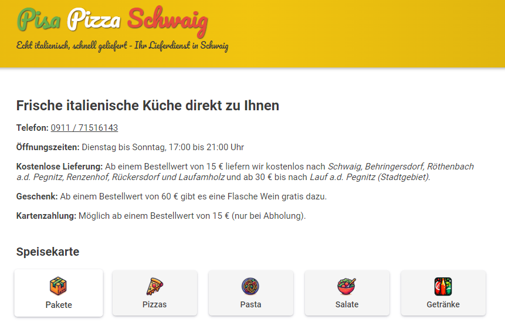

# Pisa Pizza Schwaig

## Menu

To change the menu (items, prices, descriptions, ...), edit the following files, commit and push.

- Packages: [src/app/packages/packages.ts](src/app/packages/packages.ts)
- Pizzas: [src/app/pizzas/pizzas.ts](src/app/pizzas/pizzas.ts)
- Pastas: [src/app/pastas/pastas.ts](src/app/pastas/pastas.ts)
- Salads: [src/app/salads/salads.ts](src/app/salads/salads.ts)
- Drinks: [src/app/drinks/drinks.ts](src/app/drinks/drinks.ts)
- Announcements: [src/app/announcements/announcements.ts](src/app/announcements/announcements.ts)

## Deployment

Just commit and push to the **main** branch. The CI/CD will deploy automatically to GitHub Pages 🚀.
